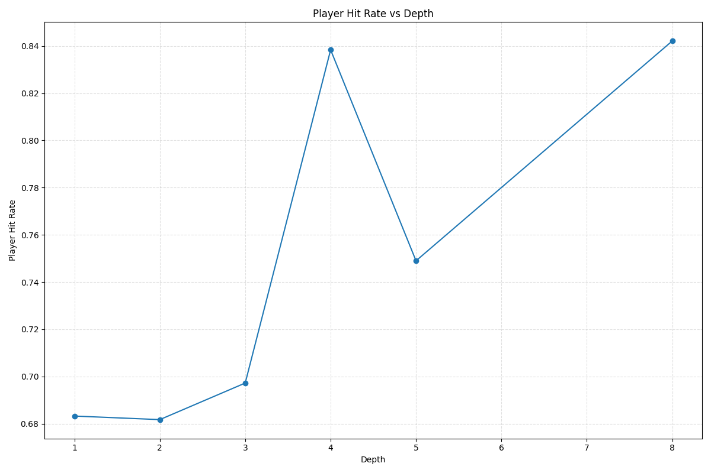
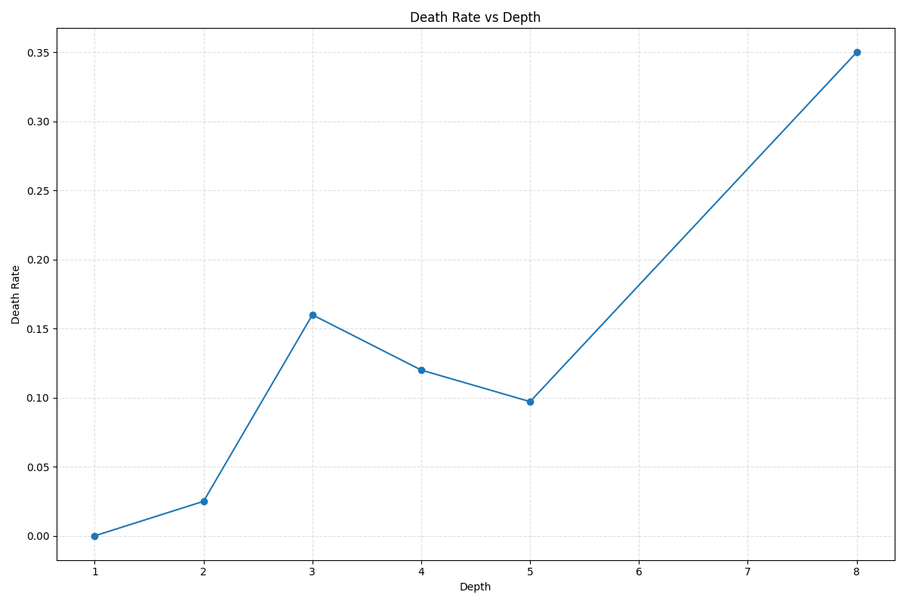
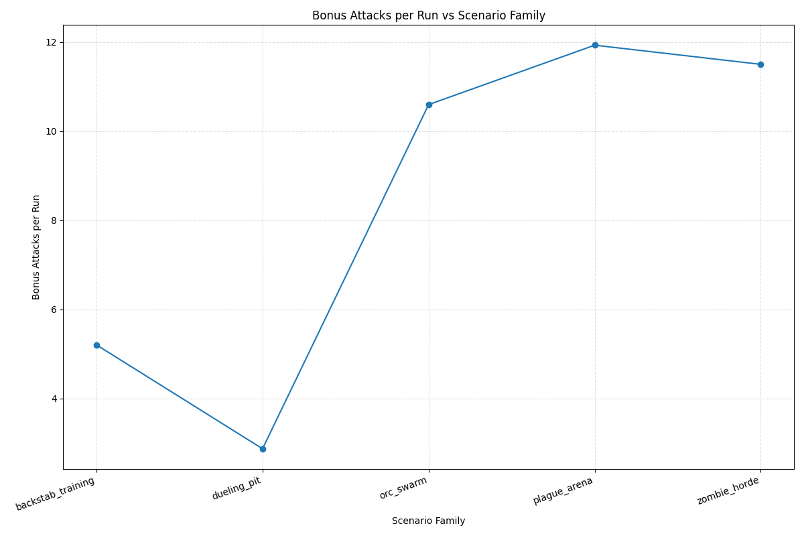
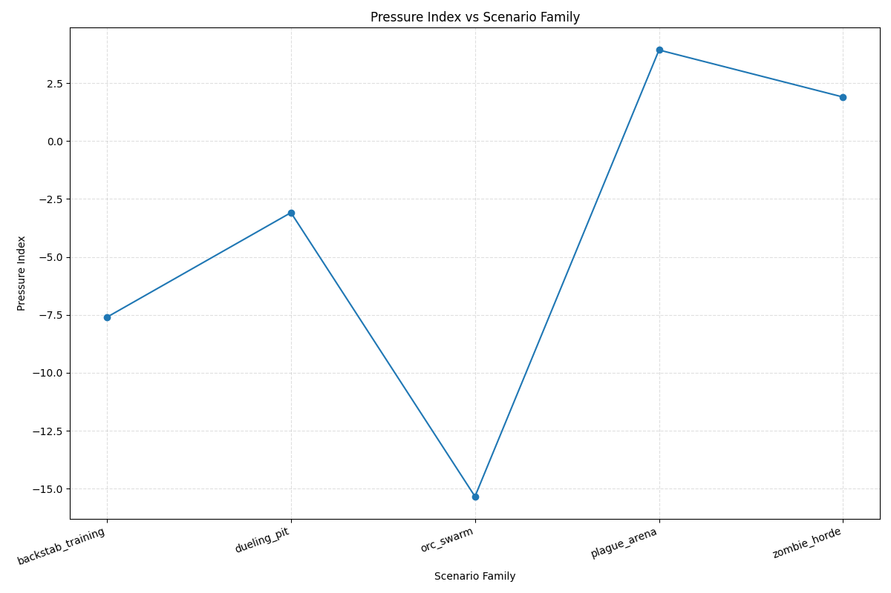
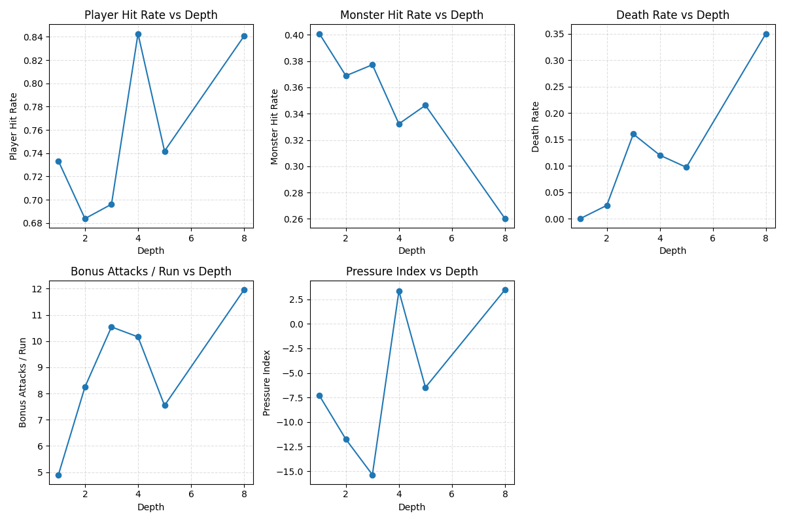

# Difficulty Curve Dashboard
_Updated: 2025-12-12_

[Eco Balance Report](reports/eco_balance_report.md)

## Overview
- Scenarios: 18
- Metrics source: `/Users/rafehatfield/development/rlike/reports/metrics`
- Graphs: `/Users/rafehatfield/development/rlike/reports/graphs`

## Summary Table

| scenario | family | depth | runs | death% | player_hit% | monster_hit% | bonus/run | pressure_index |
| --- | --- | --- | --- | --- | --- | --- | --- | --- |
| backstab_training | backstab_training | 5 | 100 | 0.0% | 68.8% | 46.7% | 5.50 | -8.01 |
| depth1_orc_easy | depth1_orc | 1 | 30 | 0.0% | 68.3% | 37.6% | 5.30 | -7.77 |
| depth2_orc_baseline | depth2_orc | 2 | 40 | 2.5% | 68.2% | 37.9% | 8.07 | -11.65 |
| depth3_orc_brutal | depth3_orc | 3 | 50 | 6.0% | 69.7% | 34.8% | 10.50 | -15.14 |
| depth4_plague | depth4_plague | 4 | 50 | 12.0% | 83.8% | 36.5% | 9.14 | 4.84 |
| depth5_zombie | depth5_zombie | 5 | 50 | 38.0% | 85.7% | 34.3% | 13.88 | 15.92 |
| dueling_pit | dueling_pit | 5 | 50 | 0.0% | 68.4% | 41.8% | 2.52 | -3.84 |
| dueling_pit_slow_zombie_baseline | dueling_pit | 5 | 50 | 2.0% | 84.1% | 27.5% | 3.34 | 0.76 |
| dueling_pit_slow_zombie_speed_full | dueling_pit | 5 | 50 | 0.0% | 86.4% | 21.8% | 2.42 | -3.86 |
| dueling_pit_speed_full | dueling_pit | 5 | 50 | 0.0% | 74.3% | 34.5% | 3.28 | -4.42 |
| dueling_pit_speed_light | dueling_pit | 5 | 50 | 0.0% | 72.7% | 41.6% | 2.76 | -3.96 |
| orc_swarm_baseline | orc_swarm | 5 | 50 | 8.0% | 68.4% | 35.7% | 10.84 | -15.76 |
| orc_swarm_brutal_baseline | orc_swarm | 5 | 50 | 30.0% | 69.7% | 38.2% | 12.62 | -18.22 |
| orc_swarm_brutal_speed_full | orc_swarm | 5 | 50 | 6.0% | 75.0% | 28.5% | 15.60 | -21.26 |
| orc_swarm_speed_full | orc_swarm | 5 | 50 | 0.0% | 75.0% | 32.1% | 9.54 | -13.02 |
| orc_swarm_tight | orc_swarm | 5 | 50 | 40.0% | 67.3% | 50.5% | 3.84 | -7.20 |
| plague_arena | plague_arena | 8 | 100 | 29.0% | 84.2% | 24.9% | 12.05 | 3.43 |
| zombie_horde | zombie_horde | 5 | 50 | 4.0% | 84.0% | 19.1% | 11.96 | 1.00 |

## Graphs












## Family Insights
- **backstab_training** — deaths 0–0%, player hit ~69%, monster hit ~47%, bonus/run ~6, pressure index ~-8.0 (player drives tempo).
- **depth1_orc** — deaths 0–0%, player hit ~68%, monster hit ~38%, bonus/run ~5, pressure index ~-7.8 (player drives tempo).
- **depth2_orc** — deaths 2–2%, player hit ~68%, monster hit ~38%, bonus/run ~8, pressure index ~-11.7 (player drives tempo).
- **depth3_orc** — deaths 6–6%, player hit ~70%, monster hit ~35%, bonus/run ~10, pressure index ~-15.1 (player drives tempo).
- **depth4_plague** — deaths 12–12%, player hit ~84%, monster hit ~37%, bonus/run ~9, pressure index ~4.8 (balanced tempo).
- **depth5_zombie** — deaths 38–38%, player hit ~86%, monster hit ~34%, bonus/run ~14, pressure index ~15.9 (monsters drive tempo).
- **dueling_pit** — deaths 0–2%, player hit ~77%, monster hit ~33%, bonus/run ~3, pressure index ~-3.1 (balanced tempo).
- **orc_swarm** — deaths 0–40%, player hit ~71%, monster hit ~37%, bonus/run ~10, pressure index ~-15.1 (player drives tempo).
- **plague_arena** — deaths 29–29%, player hit ~84%, monster hit ~25%, bonus/run ~12, pressure index ~3.4 (balanced tempo).
- **zombie_horde** — deaths 4–4%, player hit ~84%, monster hit ~19%, bonus/run ~12, pressure index ~1.0 (balanced tempo).

## Scenario Breakdown
### backstab_training
- family: backstab_training
- depth: 5
- runs: 100
- death_rate: 0.000
- player_hit_rate: 0.688
- monster_hit_rate: 0.467
- bonus_attacks_per_run: 5.500
- pressure_index: -8.010

### depth1_orc_easy
- family: depth1_orc
- depth: 1
- runs: 30
- death_rate: 0.000
- player_hit_rate: 0.683
- monster_hit_rate: 0.376
- bonus_attacks_per_run: 5.300
- pressure_index: -7.767

### depth2_orc_baseline
- family: depth2_orc
- depth: 2
- runs: 40
- death_rate: 0.025
- player_hit_rate: 0.682
- monster_hit_rate: 0.379
- bonus_attacks_per_run: 8.075
- pressure_index: -11.650

### depth3_orc_brutal
- family: depth3_orc
- depth: 3
- runs: 50
- death_rate: 0.060
- player_hit_rate: 0.697
- monster_hit_rate: 0.348
- bonus_attacks_per_run: 10.500
- pressure_index: -15.140

### depth4_plague
- family: depth4_plague
- depth: 4
- runs: 50
- death_rate: 0.120
- player_hit_rate: 0.838
- monster_hit_rate: 0.365
- bonus_attacks_per_run: 9.140
- pressure_index: 4.840

### depth5_zombie
- family: depth5_zombie
- depth: 5
- runs: 50
- death_rate: 0.380
- player_hit_rate: 0.857
- monster_hit_rate: 0.343
- bonus_attacks_per_run: 13.880
- pressure_index: 15.920

### dueling_pit
- family: dueling_pit
- depth: 5
- runs: 50
- death_rate: 0.000
- player_hit_rate: 0.684
- monster_hit_rate: 0.418
- bonus_attacks_per_run: 2.520
- pressure_index: -3.840

### dueling_pit_slow_zombie_baseline
- family: dueling_pit
- depth: 5
- runs: 50
- death_rate: 0.020
- player_hit_rate: 0.841
- monster_hit_rate: 0.275
- bonus_attacks_per_run: 3.340
- pressure_index: 0.760

### dueling_pit_slow_zombie_speed_full
- family: dueling_pit
- depth: 5
- runs: 50
- death_rate: 0.000
- player_hit_rate: 0.864
- monster_hit_rate: 0.218
- bonus_attacks_per_run: 2.420
- pressure_index: -3.860

### dueling_pit_speed_full
- family: dueling_pit
- depth: 5
- runs: 50
- death_rate: 0.000
- player_hit_rate: 0.743
- monster_hit_rate: 0.345
- bonus_attacks_per_run: 3.280
- pressure_index: -4.420

### dueling_pit_speed_light
- family: dueling_pit
- depth: 5
- runs: 50
- death_rate: 0.000
- player_hit_rate: 0.727
- monster_hit_rate: 0.416
- bonus_attacks_per_run: 2.760
- pressure_index: -3.960

### orc_swarm_baseline
- family: orc_swarm
- depth: 5
- runs: 50
- death_rate: 0.080
- player_hit_rate: 0.684
- monster_hit_rate: 0.357
- bonus_attacks_per_run: 10.840
- pressure_index: -15.760

### orc_swarm_brutal_baseline
- family: orc_swarm
- depth: 5
- runs: 50
- death_rate: 0.300
- player_hit_rate: 0.697
- monster_hit_rate: 0.382
- bonus_attacks_per_run: 12.620
- pressure_index: -18.220

### orc_swarm_brutal_speed_full
- family: orc_swarm
- depth: 5
- runs: 50
- death_rate: 0.060
- player_hit_rate: 0.750
- monster_hit_rate: 0.285
- bonus_attacks_per_run: 15.600
- pressure_index: -21.260

### orc_swarm_speed_full
- family: orc_swarm
- depth: 5
- runs: 50
- death_rate: 0.000
- player_hit_rate: 0.750
- monster_hit_rate: 0.321
- bonus_attacks_per_run: 9.540
- pressure_index: -13.020

### orc_swarm_tight
- family: orc_swarm
- depth: 5
- runs: 50
- death_rate: 0.400
- player_hit_rate: 0.673
- monster_hit_rate: 0.505
- bonus_attacks_per_run: 3.840
- pressure_index: -7.200

### plague_arena
- family: plague_arena
- depth: 8
- runs: 100
- death_rate: 0.290
- player_hit_rate: 0.842
- monster_hit_rate: 0.249
- bonus_attacks_per_run: 12.050
- pressure_index: 3.430

### zombie_horde
- family: zombie_horde
- depth: 5
- runs: 50
- death_rate: 0.040
- player_hit_rate: 0.840
- monster_hit_rate: 0.191
- bonus_attacks_per_run: 11.960
- pressure_index: 1.000

## Raw Metrics (appendix)

<details><summary>backstab_training</summary>

```json
{
  "_source_path": "/Users/rafehatfield/development/rlike/reports/metrics/backstab_training_metrics.json",
  "bonus_attacks_per_run": 5.5,
  "death_rate": 0.0,
  "depth": 5,
  "family": "backstab_training",
  "monster_attacks_per_run": 7.77,
  "monster_hit_rate": 0.4671814671814672,
  "player_attacks_per_run": 15.78,
  "player_hit_rate": 0.6875792141951838,
  "pressure_index": -8.01,
  "raw": {
    "depth": 5,
    "metrics": {
      "average_turns": 25.0,
      "depth": 5,
      "player_deaths": 0,
      "runs": 100,
      "total_bonus_attacks_triggered": 550,
      "total_kills_by_faction": {
        "Player": 200
      },
      "total_kills_by_source": {
        "PLAYER": 200
      },
      "total_monster_attacks": 777,
      "total_monster_hits": 363,
      "total_plague_infections": 0,
      "total_player_attacks": 1578,
      "total_player_hits": 1085,
      "total_portals_used": 0,
      "total_reanimations": 0,
      "total_surprise_attacks": 200
    },
    "player_bot": "tactical_fighter",
    "runs": 100,
    "scenario_id": "backstab_training",
    "turn_limit": 50
  },
  "runs": 100,
  "scenario_id": "backstab_training"
}
```

</details>

<details><summary>depth1_orc_easy</summary>

```json
{
  "_source_path": "/Users/rafehatfield/development/rlike/reports/metrics/depth1_orc_easy_metrics.json",
  "bonus_attacks_per_run": 5.3,
  "death_rate": 0.0,
  "depth": 1,
  "family": "depth1_orc",
  "monster_attacks_per_run": 8.333333333333334,
  "monster_hit_rate": 0.376,
  "player_attacks_per_run": 16.1,
  "player_hit_rate": 0.6832298136645962,
  "pressure_index": -7.7666666666666675,
  "raw": {
    "depth": 1,
    "metrics": {
      "average_turns": 40.0,
      "depth": 1,
      "player_deaths": 0,
      "runs": 30,
      "total_bonus_attacks_triggered": 159,
      "total_kills_by_faction": {
        "Player": 60
      },
      "total_kills_by_source": {
        "PLAYER": 60
      },
      "total_monster_attacks": 250,
      "total_monster_hits": 94,
      "total_plague_infections": 0,
      "total_player_attacks": 483,
      "total_player_hits": 330,
      "total_portals_used": 0,
      "total_reanimations": 0,
      "total_surprise_attacks": 60
    },
    "player_bot": "tactical_fighter",
    "runs": 30,
    "scenario_id": "depth1_orc_easy",
    "turn_limit": 80
  },
  "runs": 30,
  "scenario_id": "depth1_orc_easy"
}
```

</details>

<details><summary>depth2_orc_baseline</summary>

```json
{
  "_source_path": "/Users/rafehatfield/development/rlike/reports/metrics/depth2_orc_baseline_metrics.json",
  "bonus_attacks_per_run": 8.075,
  "death_rate": 0.025,
  "depth": 2,
  "family": "depth2_orc",
  "monster_attacks_per_run": 11.6,
  "monster_hit_rate": 0.3793103448275862,
  "player_attacks_per_run": 23.25,
  "player_hit_rate": 0.6817204301075269,
  "pressure_index": -11.65,
  "raw": {
    "depth": 2,
    "metrics": {
      "average_turns": 49.25,
      "depth": 2,
      "player_deaths": 1,
      "runs": 40,
      "total_bonus_attacks_triggered": 323,
      "total_kills_by_faction": {
        "Orc": 1,
        "Player": 119
      },
      "total_kills_by_source": {
        "MONSTERS": 1,
        "PLAYER": 119
      },
      "total_monster_attacks": 464,
      "total_monster_hits": 176,
      "total_plague_infections": 0,
      "total_player_attacks": 930,
      "total_player_hits": 634,
      "total_portals_used": 0,
      "total_reanimations": 0,
      "total_surprise_attacks": 120
    },
    "player_bot": "tactical_fighter",
    "runs": 40,
    "scenario_id": "depth2_orc_baseline",
    "turn_limit": 100
  },
  "runs": 40,
  "scenario_id": "depth2_orc_baseline"
}
```

</details>

<details><summary>depth3_orc_brutal</summary>

```json
{
  "_source_path": "/Users/rafehatfield/development/rlike/reports/metrics/depth3_orc_brutal_metrics.json",
  "bonus_attacks_per_run": 10.5,
  "death_rate": 0.06,
  "depth": 3,
  "family": "depth3_orc",
  "monster_attacks_per_run": 14.98,
  "monster_hit_rate": 0.3484646194926569,
  "player_attacks_per_run": 30.12,
  "player_hit_rate": 0.6972111553784861,
  "pressure_index": -15.14,
  "raw": {
    "depth": 3,
    "metrics": {
      "average_turns": 53.14,
      "depth": 3,
      "player_deaths": 3,
      "runs": 50,
      "total_bonus_attacks_triggered": 525,
      "total_kills_by_faction": {
        "Orc": 3,
        "Player": 196
      },
      "total_kills_by_source": {
        "MONSTERS": 3,
        "PLAYER": 196
      },
      "total_monster_attacks": 749,
      "total_monster_hits": 261,
      "total_plague_infections": 0,
      "total_player_attacks": 1506,
      "total_player_hits": 1050,
      "total_portals_used": 0,
      "total_reanimations": 0,
      "total_surprise_attacks": 199
    },
    "player_bot": "tactical_fighter",
    "runs": 50,
    "scenario_id": "depth3_orc_brutal",
    "turn_limit": 110
  },
  "runs": 50,
  "scenario_id": "depth3_orc_brutal"
}
```

</details>

<details><summary>depth4_plague</summary>

```json
{
  "_source_path": "/Users/rafehatfield/development/rlike/reports/metrics/depth4_plague_metrics.json",
  "bonus_attacks_per_run": 9.14,
  "death_rate": 0.12,
  "depth": 4,
  "family": "depth4_plague",
  "monster_attacks_per_run": 24.76,
  "monster_hit_rate": 0.3651050080775444,
  "player_attacks_per_run": 19.92,
  "player_hit_rate": 0.8383534136546185,
  "pressure_index": 4.84,
  "raw": {
    "depth": 4,
    "metrics": {
      "average_turns": 64.24,
      "depth": 4,
      "player_deaths": 6,
      "runs": 50,
      "total_bonus_attacks_triggered": 457,
      "total_kills_by_faction": {
        "Plague_Zombie": 13,
        "Player": 160,
        "Revenant Plague_Zombie": 1,
        "Revenant Zombie": 2,
        "Zombie": 22
      },
      "total_kills_by_source": {
        "MONSTERS": 38,
        "PLAYER": 160
      },
      "total_monster_attacks": 1238,
      "total_monster_hits": 452,
      "total_plague_infections": 52,
      "total_player_attacks": 996,
      "total_player_hits": 835,
      "total_portals_used": 0,
      "total_reanimations": 16,
      "total_surprise_attacks": 168
    },
    "player_bot": "tactical_fighter",
    "runs": 50,
    "scenario_id": "depth4_plague",
    "turn_limit": 140
  },
  "runs": 50,
  "scenario_id": "depth4_plague"
}
```

</details>

<details><summary>depth5_zombie</summary>

```json
{
  "_source_path": "/Users/rafehatfield/development/rlike/reports/metrics/depth5_zombie_metrics.json",
  "bonus_attacks_per_run": 13.88,
  "death_rate": 0.38,
  "depth": 5,
  "family": "depth5_zombie",
  "monster_attacks_per_run": 41.94,
  "monster_hit_rate": 0.34334763948497854,
  "player_attacks_per_run": 26.02,
  "player_hit_rate": 0.857033051498847,
  "pressure_index": 15.919999999999998,
  "raw": {
    "depth": 5,
    "metrics": {
      "average_turns": 58.32,
      "depth": 5,
      "player_deaths": 19,
      "runs": 50,
      "total_bonus_attacks_triggered": 694,
      "total_kills_by_faction": {
        "Player": 277,
        "Zombie": 70
      },
      "total_kills_by_source": {
        "MONSTERS": 70,
        "PLAYER": 277
      },
      "total_monster_attacks": 2097,
      "total_monster_hits": 720,
      "total_plague_infections": 0,
      "total_player_attacks": 1301,
      "total_player_hits": 1115,
      "total_portals_used": 0,
      "total_reanimations": 0,
      "total_surprise_attacks": 341
    },
    "player_bot": "tactical_fighter",
    "runs": 50,
    "scenario_id": "depth5_zombie",
    "turn_limit": 150
  },
  "runs": 50,
  "scenario_id": "depth5_zombie"
}
```

</details>

<details><summary>dueling_pit</summary>

```json
{
  "_source_path": "/Users/rafehatfield/development/rlike/reports/metrics/dueling_pit_metrics.json",
  "bonus_attacks_per_run": 2.52,
  "death_rate": 0.0,
  "depth": 5,
  "family": "dueling_pit",
  "monster_attacks_per_run": 3.88,
  "monster_hit_rate": 0.4175257731958763,
  "player_attacks_per_run": 7.72,
  "player_hit_rate": 0.6839378238341969,
  "pressure_index": -3.84,
  "raw": {
    "depth": 5,
    "metrics": {
      "average_turns": 50.0,
      "depth": 5,
      "player_deaths": 0,
      "runs": 50,
      "total_bonus_attacks_triggered": 126,
      "total_kills_by_faction": {
        "Player": 50
      },
      "total_kills_by_source": {
        "PLAYER": 50
      },
      "total_monster_attacks": 194,
      "total_monster_hits": 81,
      "total_plague_infections": 0,
      "total_player_attacks": 386,
      "total_player_hits": 264,
      "total_portals_used": 0,
      "total_reanimations": 0,
      "total_surprise_attacks": 50
    },
    "player_bot": "tactical_fighter",
    "runs": 50,
    "scenario_id": "dueling_pit",
    "turn_limit": 100
  },
  "runs": 50,
  "scenario_id": "dueling_pit"
}
```

</details>

<details><summary>dueling_pit_slow_zombie_baseline</summary>

```json
{
  "_source_path": "/Users/rafehatfield/development/rlike/reports/metrics/dueling_pit_slow_zombie_baseline_metrics.json",
  "bonus_attacks_per_run": 3.34,
  "death_rate": 0.02,
  "depth": 5,
  "family": "dueling_pit",
  "monster_attacks_per_run": 6.04,
  "monster_hit_rate": 0.27483443708609273,
  "player_attacks_per_run": 5.28,
  "player_hit_rate": 0.8409090909090909,
  "pressure_index": 0.7599999999999998,
  "raw": {
    "depth": 5,
    "metrics": {
      "average_turns": 49.26,
      "depth": 5,
      "player_deaths": 1,
      "runs": 50,
      "total_bonus_attacks_triggered": 167,
      "total_kills_by_faction": {
        "Player": 49,
        "Zombie": 1
      },
      "total_kills_by_source": {
        "MONSTERS": 1,
        "PLAYER": 49
      },
      "total_monster_attacks": 302,
      "total_monster_hits": 83,
      "total_plague_infections": 0,
      "total_player_attacks": 264,
      "total_player_hits": 222,
      "total_portals_used": 0,
      "total_reanimations": 0,
      "total_surprise_attacks": 50
    },
    "player_bot": "tactical_fighter",
    "runs": 50,
    "scenario_id": "dueling_pit_slow_zombie_baseline",
    "turn_limit": 100
  },
  "runs": 50,
  "scenario_id": "dueling_pit_slow_zombie_baseline"
}
```

</details>

<details><summary>dueling_pit_slow_zombie_speed_full</summary>

```json
{
  "_source_path": "/Users/rafehatfield/development/rlike/reports/metrics/dueling_pit_slow_zombie_speed_full_metrics.json",
  "bonus_attacks_per_run": 2.42,
  "death_rate": 0.0,
  "depth": 5,
  "family": "dueling_pit",
  "monster_attacks_per_run": 1.74,
  "monster_hit_rate": 0.21839080459770116,
  "player_attacks_per_run": 5.6,
  "player_hit_rate": 0.8642857142857143,
  "pressure_index": -3.8599999999999994,
  "raw": {
    "depth": 5,
    "metrics": {
      "average_turns": 50.0,
      "depth": 5,
      "player_deaths": 0,
      "runs": 50,
      "total_bonus_attacks_triggered": 121,
      "total_kills_by_faction": {
        "Player": 50
      },
      "total_kills_by_source": {
        "PLAYER": 50
      },
      "total_monster_attacks": 87,
      "total_monster_hits": 19,
      "total_plague_infections": 0,
      "total_player_attacks": 280,
      "total_player_hits": 242,
      "total_portals_used": 0,
      "total_reanimations": 0,
      "total_surprise_attacks": 50
    },
    "player_bot": "tactical_fighter",
    "runs": 50,
    "scenario_id": "dueling_pit_slow_zombie_speed_full",
    "turn_limit": 100
  },
  "runs": 50,
  "scenario_id": "dueling_pit_slow_zombie_speed_full"
}
```

</details>

<details><summary>dueling_pit_speed_full</summary>

```json
{
  "_source_path": "/Users/rafehatfield/development/rlike/reports/metrics/dueling_pit_speed_full_metrics.json",
  "bonus_attacks_per_run": 3.28,
  "death_rate": 0.0,
  "depth": 5,
  "family": "dueling_pit",
  "monster_attacks_per_run": 2.9,
  "monster_hit_rate": 0.3448275862068966,
  "player_attacks_per_run": 7.32,
  "player_hit_rate": 0.7431693989071039,
  "pressure_index": -4.42,
  "raw": {
    "depth": 5,
    "metrics": {
      "average_turns": 50.0,
      "depth": 5,
      "player_deaths": 0,
      "runs": 50,
      "total_bonus_attacks_triggered": 164,
      "total_kills_by_faction": {
        "Player": 50
      },
      "total_kills_by_source": {
        "PLAYER": 50
      },
      "total_monster_attacks": 145,
      "total_monster_hits": 50,
      "total_plague_infections": 0,
      "total_player_attacks": 366,
      "total_player_hits": 272,
      "total_portals_used": 0,
      "total_reanimations": 0,
      "total_surprise_attacks": 50
    },
    "player_bot": "tactical_fighter",
    "runs": 50,
    "scenario_id": "dueling_pit_speed_full",
    "turn_limit": 100
  },
  "runs": 50,
  "scenario_id": "dueling_pit_speed_full"
}
```

</details>

<details><summary>dueling_pit_speed_light</summary>

```json
{
  "_source_path": "/Users/rafehatfield/development/rlike/reports/metrics/dueling_pit_speed_light_metrics.json",
  "bonus_attacks_per_run": 2.76,
  "death_rate": 0.0,
  "depth": 5,
  "family": "dueling_pit",
  "monster_attacks_per_run": 3.08,
  "monster_hit_rate": 0.4155844155844156,
  "player_attacks_per_run": 7.04,
  "player_hit_rate": 0.7272727272727273,
  "pressure_index": -3.96,
  "raw": {
    "depth": 5,
    "metrics": {
      "average_turns": 50.0,
      "depth": 5,
      "player_deaths": 0,
      "runs": 50,
      "total_bonus_attacks_triggered": 138,
      "total_kills_by_faction": {
        "Player": 50
      },
      "total_kills_by_source": {
        "PLAYER": 50
      },
      "total_monster_attacks": 154,
      "total_monster_hits": 64,
      "total_plague_infections": 0,
      "total_player_attacks": 352,
      "total_player_hits": 256,
      "total_portals_used": 0,
      "total_reanimations": 0,
      "total_surprise_attacks": 50
    },
    "player_bot": "tactical_fighter",
    "runs": 50,
    "scenario_id": "dueling_pit_speed_light",
    "turn_limit": 100
  },
  "runs": 50,
  "scenario_id": "dueling_pit_speed_light"
}
```

</details>

<details><summary>orc_swarm_baseline</summary>

```json
{
  "_source_path": "/Users/rafehatfield/development/rlike/reports/metrics/orc_swarm_baseline_metrics.json",
  "bonus_attacks_per_run": 10.84,
  "death_rate": 0.08,
  "depth": 5,
  "family": "orc_swarm",
  "monster_attacks_per_run": 15.86,
  "monster_hit_rate": 0.35687263556116017,
  "player_attacks_per_run": 31.62,
  "player_hit_rate": 0.6843769765970904,
  "pressure_index": -15.760000000000002,
  "raw": {
    "depth": 5,
    "metrics": {
      "average_turns": 48.26,
      "depth": 5,
      "player_deaths": 4,
      "runs": 50,
      "total_bonus_attacks_triggered": 542,
      "total_kills_by_faction": {
        "Orc": 4,
        "Player": 196
      },
      "total_kills_by_source": {
        "MONSTERS": 4,
        "PLAYER": 196
      },
      "total_monster_attacks": 793,
      "total_monster_hits": 283,
      "total_plague_infections": 0,
      "total_player_attacks": 1581,
      "total_player_hits": 1082,
      "total_portals_used": 0,
      "total_reanimations": 0,
      "total_surprise_attacks": 200
    },
    "player_bot": "tactical_fighter",
    "runs": 50,
    "scenario_id": "orc_swarm_baseline",
    "turn_limit": 100
  },
  "runs": 50,
  "scenario_id": "orc_swarm_baseline"
}
```

</details>

<details><summary>orc_swarm_brutal_baseline</summary>

```json
{
  "_source_path": "/Users/rafehatfield/development/rlike/reports/metrics/orc_swarm_brutal_baseline_metrics.json",
  "bonus_attacks_per_run": 12.62,
  "death_rate": 0.3,
  "depth": 5,
  "family": "orc_swarm",
  "monster_attacks_per_run": 18.1,
  "monster_hit_rate": 0.38232044198895027,
  "player_attacks_per_run": 36.32,
  "player_hit_rate": 0.6965859030837004,
  "pressure_index": -18.22,
  "raw": {
    "depth": 5,
    "metrics": {
      "average_turns": 43.8,
      "depth": 5,
      "player_deaths": 15,
      "runs": 50,
      "total_bonus_attacks_triggered": 631,
      "total_kills_by_faction": {
        "Orc": 15,
        "Player": 225
      },
      "total_kills_by_source": {
        "MONSTERS": 15,
        "PLAYER": 225
      },
      "total_monster_attacks": 905,
      "total_monster_hits": 346,
      "total_plague_infections": 0,
      "total_player_attacks": 1816,
      "total_player_hits": 1265,
      "total_portals_used": 0,
      "total_reanimations": 0,
      "total_surprise_attacks": 240
    },
    "player_bot": "tactical_fighter",
    "runs": 50,
    "scenario_id": "orc_swarm_brutal_baseline",
    "turn_limit": 100
  },
  "runs": 50,
  "scenario_id": "orc_swarm_brutal_baseline"
}
```

</details>

<details><summary>orc_swarm_brutal_speed_full</summary>

```json
{
  "_source_path": "/Users/rafehatfield/development/rlike/reports/metrics/orc_swarm_brutal_speed_full_metrics.json",
  "bonus_attacks_per_run": 15.6,
  "death_rate": 0.06,
  "depth": 5,
  "family": "orc_swarm",
  "monster_attacks_per_run": 14.2,
  "monster_hit_rate": 0.28450704225352114,
  "player_attacks_per_run": 35.46,
  "player_hit_rate": 0.7501410039481106,
  "pressure_index": -21.26,
  "raw": {
    "depth": 5,
    "metrics": {
      "average_turns": 48.44,
      "depth": 5,
      "player_deaths": 3,
      "runs": 50,
      "total_bonus_attacks_triggered": 780,
      "total_kills_by_faction": {
        "Orc": 3,
        "Player": 245
      },
      "total_kills_by_source": {
        "MONSTERS": 3,
        "PLAYER": 245
      },
      "total_monster_attacks": 710,
      "total_monster_hits": 202,
      "total_plague_infections": 0,
      "total_player_attacks": 1773,
      "total_player_hits": 1330,
      "total_portals_used": 0,
      "total_reanimations": 0,
      "total_surprise_attacks": 248
    },
    "player_bot": "tactical_fighter",
    "runs": 50,
    "scenario_id": "orc_swarm_brutal_speed_full",
    "turn_limit": 100
  },
  "runs": 50,
  "scenario_id": "orc_swarm_brutal_speed_full"
}
```

</details>

<details><summary>orc_swarm_speed_full</summary>

```json
{
  "_source_path": "/Users/rafehatfield/development/rlike/reports/metrics/orc_swarm_speed_full_metrics.json",
  "bonus_attacks_per_run": 9.54,
  "death_rate": 0.0,
  "depth": 5,
  "family": "orc_swarm",
  "monster_attacks_per_run": 8.42,
  "monster_hit_rate": 0.32066508313539194,
  "player_attacks_per_run": 21.44,
  "player_hit_rate": 0.75,
  "pressure_index": -13.020000000000001,
  "raw": {
    "depth": 5,
    "metrics": {
      "average_turns": 50.0,
      "depth": 5,
      "player_deaths": 0,
      "runs": 50,
      "total_bonus_attacks_triggered": 477,
      "total_kills_by_faction": {
        "Player": 150
      },
      "total_kills_by_source": {
        "PLAYER": 150
      },
      "total_monster_attacks": 421,
      "total_monster_hits": 135,
      "total_plague_infections": 0,
      "total_player_attacks": 1072,
      "total_player_hits": 804,
      "total_portals_used": 0,
      "total_reanimations": 0,
      "total_surprise_attacks": 150
    },
    "player_bot": "tactical_fighter",
    "runs": 50,
    "scenario_id": "orc_swarm_speed_full",
    "turn_limit": 100
  },
  "runs": 50,
  "scenario_id": "orc_swarm_speed_full"
}
```

</details>

<details><summary>orc_swarm_tight</summary>

```json
{
  "_source_path": "/Users/rafehatfield/development/rlike/reports/metrics/orc_swarm_tight_metrics.json",
  "bonus_attacks_per_run": 3.84,
  "death_rate": 0.4,
  "depth": 5,
  "family": "orc_swarm",
  "monster_attacks_per_run": 14.42,
  "monster_hit_rate": 0.5048543689320388,
  "player_attacks_per_run": 21.62,
  "player_hit_rate": 0.6725254394079556,
  "pressure_index": -7.200000000000001,
  "raw": {
    "depth": 5,
    "metrics": {
      "average_turns": 42.86,
      "depth": 5,
      "player_deaths": 20,
      "runs": 50,
      "total_bonus_attacks_triggered": 192,
      "total_kills_by_faction": {
        "Orc_Chieftain": 3,
        "Orc_Veteran": 17,
        "Player": 120
      },
      "total_kills_by_source": {
        "MONSTERS": 20,
        "PLAYER": 120
      },
      "total_monster_attacks": 721,
      "total_monster_hits": 364,
      "total_plague_infections": 0,
      "total_player_attacks": 1081,
      "total_player_hits": 727,
      "total_portals_used": 0,
      "total_reanimations": 0,
      "total_surprise_attacks": 140
    },
    "player_bot": "tactical_fighter",
    "runs": 50,
    "scenario_id": "orc_swarm_tight",
    "turn_limit": 120
  },
  "runs": 50,
  "scenario_id": "orc_swarm_tight"
}
```

</details>

<details><summary>plague_arena</summary>

```json
{
  "_source_path": "/Users/rafehatfield/development/rlike/reports/metrics/plague_arena_metrics.json",
  "bonus_attacks_per_run": 12.05,
  "death_rate": 0.29,
  "depth": 8,
  "family": "plague_arena",
  "monster_attacks_per_run": 23.0,
  "monster_hit_rate": 0.24869565217391304,
  "player_attacks_per_run": 19.57,
  "player_hit_rate": 0.8421052631578947,
  "pressure_index": 3.4299999999999997,
  "raw": {
    "depth": 8,
    "metrics": {
      "average_turns": 192.16,
      "depth": 8,
      "player_deaths": 29,
      "runs": 100,
      "total_bonus_attacks_triggered": 1205,
      "total_kills_by_faction": {
        "Plague_Zombie": 29,
        "Player": 270
      },
      "total_kills_by_source": {
        "MONSTERS": 29,
        "PLAYER": 270
      },
      "total_monster_attacks": 2300,
      "total_monster_hits": 572,
      "total_plague_infections": 84,
      "total_player_attacks": 1957,
      "total_player_hits": 1648,
      "total_portals_used": 0,
      "total_reanimations": 1,
      "total_surprise_attacks": 297
    },
    "player_bot": "tactical_fighter",
    "runs": 100,
    "scenario_id": "plague_arena",
    "turn_limit": 500
  },
  "runs": 100,
  "scenario_id": "plague_arena"
}
```

</details>

<details><summary>zombie_horde</summary>

```json
{
  "_source_path": "/Users/rafehatfield/development/rlike/reports/metrics/zombie_horde_metrics.json",
  "bonus_attacks_per_run": 11.96,
  "death_rate": 0.04,
  "depth": 5,
  "family": "zombie_horde",
  "monster_attacks_per_run": 22.44,
  "monster_hit_rate": 0.19073083778966132,
  "player_attacks_per_run": 21.44,
  "player_hit_rate": 0.8404850746268657,
  "pressure_index": 1.0,
  "raw": {
    "depth": 5,
    "metrics": {
      "average_turns": 58.82,
      "depth": 5,
      "player_deaths": 2,
      "runs": 50,
      "total_bonus_attacks_triggered": 598,
      "total_kills_by_faction": {
        "Player": 247,
        "Zombie": 2
      },
      "total_kills_by_source": {
        "MONSTERS": 2,
        "PLAYER": 247
      },
      "total_monster_attacks": 1122,
      "total_monster_hits": 214,
      "total_plague_infections": 0,
      "total_player_attacks": 1072,
      "total_player_hits": 901,
      "total_portals_used": 0,
      "total_reanimations": 0,
      "total_surprise_attacks": 249
    },
    "player_bot": "tactical_fighter",
    "runs": 50,
    "scenario_id": "zombie_horde",
    "turn_limit": 120
  },
  "runs": 50,
  "scenario_id": "zombie_horde"
}
```

</details>
